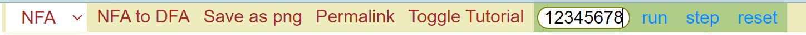
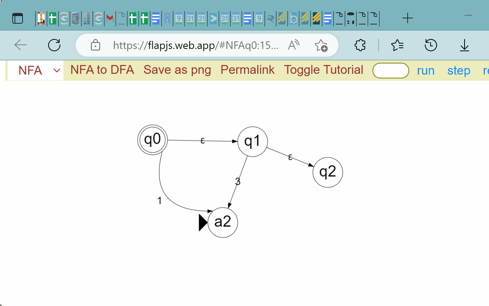

# Usage

## Welcome to [`flap.js`](https://flapjs.web.app)
This is a minimal [JFLAP](https://www.jflap.org/) clone in javscript so people can draw and interact with finite automatons in their browsers. The notations used throughout the project is chosen to be compatible with CSE 105 at UCSD.

## The Basics
TLDR: double click to create vertices and right click drag to make edges.

Additionally, dragging vertices and edges are supported and if you want to edit anything, simply right click on a vertex or **the text** on an edge. You will be prompted with a floating menu. After editing, press enter to confirm the change.

A shortcut to making a vertex final is to double click on it.

## Running Input
Enter the input string and press run. You can also step through the computation one character at a time.

## Download PNG
After you finish drawing your automaton, you can download a PNG of the drawing by clicking "Save as png" on the toolbar.

## Permalink
This feature enables sharing machine drawings. Permalink stands for permanent link, meaning once you have created a link to share with your others, that link can uniquely decode back to a machine.

